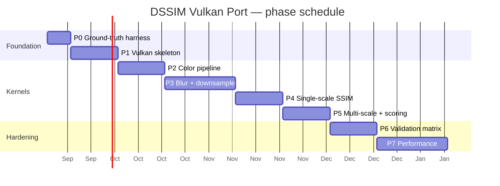

# Vulkan Port Plan — DSSIM (dssim-core → GPU compute)

**Status:** Proposed plan, not yet approved for implementation.
**Reference document:** [`deep-research-report.md`](./deep-research-report.md) (used as the high-level roadmap).
**Ground truth:** the actual algorithm in this repository — `dssim-core` 3.5.1, sources under [`dssim-core/src/`](./dssim-core/src/). Where the research report and this repo disagree, **this repo wins**; every such conflict is listed in [§2.7](#27-corrections-to-the-research-report).

---

## 1. Goals and definition of done

Deliver a new workspace crate, `dssim-vulkan`, that computes the same DSSIM score as `dssim-core` on a Vulkan compute device, with the CPU implementation kept as reference and fallback.

**Definition of done (verifiable):**

1. For every fixture in `tests/`, `|GPU score − CPU score| ≤ 5×10⁻⁶`. This is the same absolute tolerance the repo already locks in `ssim_locked_values` (`dssim-core/src/dssim.rs:505`), including the headline value `0.0009483923725199794` for `test1-sm.png` vs `test2-sm.png`.
2. Comparing an image with itself returns **exactly** `0.0` (asserted with `==`, as `dssim-core/src/dssim.rs:536` does today).
3. Sub-image and small-input scenarios (the repo's `png_compare` cases: 44×33 offsets, 61×40 aligned crops) match within the same tolerance.
4. A CLI flag (e.g. `dssim --gpu`) selects the GPU path; the default remains the proven CPU path.
5. `cargo test` passes with the GPU path exercised in CI on a software Vulkan implementation (lavapipe), so correctness tests run on GPU-less machines.

**Explicit non-goals:** GPU image decoding, ICC color-profile handling (stays on CPU), float16 math, multi-GPU scheduling, and GPU-side pooling in the first release (optional stretch in Phase 7).

---

## 2. Ground truth: what the GPU must replicate exactly

Everything in this section is cited to the code that already passes the locked tests. Any GPU kernel that disagrees with these details will fail the 5×10⁻⁶ parity bound — a wrong constant typically moves the final score by ≥10⁻³.

### 2.1 Pipeline shape (per input image)

1. **Loading and color profiles stay on CPU.** `load_image` (used in `src/main.rs:91`) handles ICC profiles, JPEG, palette PNG, etc., and hands over RGBA8 sRGB, non-premultiplied (`create_image_rgba` doc, `dssim-core/src/dssim.rs:171-181`). The GPU port uploads exactly this RGBA8 buffer.
2. **sRGB → linear via a 256-entry LUT, then premultiply by alpha.** `to_linear` (`dssim-core/src/linear.rs:34-41`) is a piecewise gamma decode; the LUT is built in `linear.rs:62-69`. Premultiplication: `r,g,b × a` in linear space (`linear.rs:95-104`), producing `RGBAPLU` (premultiplied, linear, 0..1 f32). *Do not* use the hardware sRGB sampler for this: the CPU path is a LUT and the GPU path must produce the same values (see tolerance ladder, §5).
3. **Pyramid = repeated 2×2 box average, not a Gaussian pyramid.** `downsample` (`dssim-core/src/image.rs:196-230`) averages 4 neighboring pixels (`Average4`, `image.rs:129-154`), floors odd edges (drops the last row/column on odd sizes), and **returns `None` when `width < 8 || height < 8`** (`image.rs:209`). Scale count is therefore image-dependent, capped at 5.
4. **Lab conversion runs per scale**, not once. `make_scales_recursive` (`dssim-core/src/dssim.rs:219-256`) calls `to_lab()` on the current scale's image *and* downsamples the premultiplied-linear RGB image for the next scale, interleaved. Each scale re-derives Lab from a freshly downsampled RGBAPLU.
5. **Per scale, per channel (L, a, b):**
   - Chroma channels (a, b) are pre-blurred **in place** before statistics (`dssim.rs:128-130`, `blur::blur_in_place`).
   - `mu = blur(img)` (`dssim.rs:131`).
   - `img_sq_blur = blur(img·img)` — a fused multiply+blur, single H5·V5 pass (`dssim.rs:137`, `blur::blur_mul`).
6. **Cross term:** `img1_img2_blur = blur(img1·img2)` per channel, computed per scale (`dssim.rs:142-149` and `dssim.rs:282-288`).

### 2.2 The blur — the most correctness-critical kernel

All blur variants share one separable 5-tap kernel applied as Horizontal-5 → Vertical-5 (`blur::blur`, `dssim-core/src/blur.rs:288-310`; the H pass writes a tightly-packed intermediate with stride = width).

- **The tap weights are NOT the binomial `[0.0625, 0.25, 0.375, 0.25, 0.0625]`** that the research report's pseudocode suggests. The real kernel is a fused double-3×3 (`blur.rs:1-13`):
  - 1-D base: `K_SIDE = 0.308_758_86`, `K_CENTER = 0.382_482_8` (from the 3×3 kernel `REF_KERNEL` in `blur/equiv_tests.rs:17-21`).
  - Fused 5-tap: `K5_OUTER = K_SIDE²`, `K5_INNER = 2·K_SIDE·K_CENTER`, `K5_MID = 2·K_SIDE² + K_CENTER²`.
- **Boundary handling has four distinct cases** (`blur.rs:15-29` and the edge branches in `blur_h5`/`blur_v5`, `blur.rs:40-196`):
  - First/last row & column (`j=0`, `j=w-1`, `y=0`, `y=h-1`): a 3-coefficient form derived by composing two clamped 3-tap passes — `K5_EDGE_CENTER = K5_MID + K5_INNER`, `K5_EDGE_NEAR = K5_OUTER + K5_INNER`, `K5_EDGE_FAR = K5_OUTER`. A plain clamped 5-tap would over-weight the corner pixel by `K5_OUTER` — this is exactly the kind of bug the equivalence tests exist to catch.
  - Near-edge (`j=1`, `j=w-2`, `y=1`, `y=h-2`): plain clamped 5-tap.
  - Interior: plain 5-tap.
  - Tiny sizes (`w < 5` or `h < 5`): the edge cases collapse into each other; the code handles widths/heights down to 1 and a test sweeps all of 1..=8 (`equiv_tiny_sizes`, `blur/equiv_tests.rs:224-234`).
- **Variants needed on GPU:** `blur` (plain), `blur_in_place` (chroma pre-blur), `blur_mul` (fused product of two sources — used for both `img·img` and `img1·img2`).
- The whole kernel is *bit-equivalent modulo FP reordering* to the upstream double-3×3 form, verified per-pixel at ≤5×10⁻⁶ by `blur/equiv_tests.rs` over constants, gradients, random noise, step edges, impulses, strided sub-images, and tiny sizes. The GPU shaders will be held to the same standard (§5).

### 2.3 SSIM combine (f32, explicit FMA)

`compare_scale_3ch` (`dssim-core/src/dssim.rs:335-395`) is the authoritative 3-channel formula:

```
mu1_sq  = (mu1_L² + mu1_a² + mu1_b²) / 3        // likewise mu2_sq, mu1_mu2
sigma1² = ((sq1_L − mu1_L²) + (sq1_a − mu1_a²) + (sq1_b − mu1_b²)) / 3
sigma2² = (… as above for image 2 …) / 3
sigma12 = ((i12_L − mu1_L·mu2_L) + (i12_a − mu1_a·mu2_a) + (i12_b − mu1_b·mu2_b)) / 3

ssim = 2·fma(mu1_mu2, C1) · 2·fma(sigma12, C2)
     / ( (mu1_sq + mu2_sq + C1) · (sigma1² + sigma2² + C2) )
C1 = 0.01², C2 = 0.03²
```

All arithmetic is **f32 with explicit `mul_add`** at exactly the two sites shown (`dssim.rs:390-391`). The GPU shader must use `fma()` at the same sites and keep the same association order. A scalar 1-channel path (`compare_scale`, `dssim.rs:398-436`) exists for grayscale input and must be preserved for the gray-input fixtures.

### 2.4 Pooling and final score (stay on CPU, f64, first)

Per scale `n` (n = 0 is full resolution; weights `DEFAULT_WEIGHTS = [0.028, 0.197, 0.322, 0.298, 0.155]`, `dssim.rs:85`):

```
avg_n   = (Σ map_n / len).max(0.0) ^ (2^-n)          // note the power term, dssim.rs:301
score_n = 1 − ( Σ |avg_n − p| / len )                // mean absolute deviation, dssim.rs:302
weighted = Σ score_n·w_n / Σ w_n                     // dssim.rs:315-326
DSSIM    = 1 / max(weighted, f64::EPSILON) − 1       // to_dssim, dssim.rs:439-441
```

The maps are read back per scale and pooled in f64 on the CPU. This is cheap (maps are small at higher scales; even the full-res map is one f32 per pixel) and removes an entire class of GPU reduction-order bugs from the critical path. A GPU hierarchical reduction is a Phase 7 optimization behind a flag.

Note the two details the research report omits: the **`(2^-n)` power term** on the per-scale mean, and the fact that scale count is image-dependent (§2.1 item 3).

### 2.5 Alpha handling quirk

For images with transparency, Lab conversion dithers un-premultiplication with a coordinate-dependent pseudo-random pattern: `n = (x+11) ^ (y+11)`, and channels get `+ (1 − a)` when bits `16 / 8 / 32` of `n` are set (`dssim-core/src/image.rs:160-180`, `n` computed at `tolab.rs:128`). Opaque pixels are unaffected (`a = 1` ⇒ adds 0). The GPU Lab kernel must replicate this bit-exactly or alpha-bearing images will diverge. A test fixture with real transparency should be added (none of the current `tests/` images exercise it heavily — see Phase 6).

### 2.6 Lab conversion constants

`to_lab` (`dssim-core/src/tolab.rs:12-63`) uses:

- D65 white point `0.9505, 1.0, 1.089`; sRGB→XYZ matrix rows scaled per channel (`0.4124/D65x`, … ).
- `EPSILON = 216/24389`, `K = 24389/(27·116)`, piecewise `cbrt` with a **polynomial seed + two Halley refinement steps** (`cbrt_poly`, `tolab.rs:50-63`) — not `pow(x, 1/3)`. The GPU must run the same polynomial + Halley code so results are near-bit-identical.
- Non-standard output scaling: `L' = Y·1.05` (not 1.16), `a' = fma(500/220, X−Y, 86.2/220)`, `b' = fma(200/220, Y−Z, 107.9/220)` (`tolab.rs:39-43`). These fudges are load-bearing; do not "fix" them.

### 2.7 Corrections to the research report

The report is a good roadmap but its algorithm section contains errors that would sink the port if followed literally:

| # | Report says | This repo actually does | Consequence if ignored |
|---|---|---|---|
| 1 | 5-tap Gaussian weights `[0.0625, 0.25, 0.375, 0.25, 0.0625]` | Fused double-3×3 kernel, `K5_*` constants (`blur.rs:4-29`) | Final score off by ≥10⁻³; locked tests fail |
| 2 | Gaussian pyramid | 2×2 box average, stops below 8 px (`image.rs:196-230`) | Wrong scale count/contents; parity fails |
| 3 | Lab conversion once | Lab re-computed **per scale** (`dssim.rs:219-256`) | Wrong statistics at every scale > 0 |
| 4 | Pooling = plain mean + MAD | MAD around `mean^(2^-n)` power term (`dssim.rs:301`) | Scores drift ~10⁻⁴ at deep scales |
| 5 | Simple clamped edges on blur | 4-case boundary incl. H1·H1-derived edge weights (`blur.rs:15-29`) | Boundary-ring divergence; equiv tests fail |
| 6 | sRGB sampler can linearize | LUT-based decode + premultiply (`linear.rs`) | Values differ at LUT resolution level |

### 2.8 Golden values already in the repo

- `ssim_locked_values` (`dssim.rs:499-550`): full-image, identity (exactly 0), two sub-image scenarios — tolerance 5×10⁻⁶, with a documented error budget (FP reordering ≤1.5×10⁻⁷, SIMD paths ≤5.6×10⁻⁷).
- `png_compare` (`dssim.rs:443-478`), `image_gray`, `image_gray_profile`, `image_load1` (`src/main.rs:156-205`): gray/palette/profile/JPEG scenarios with loose thresholds — these define the *CPU* acceptance bar; the GPU port must additionally satisfy the 5×10⁻⁶ bar on the same fixtures.
- `blur/equiv_tests.rs`: per-pixel blur parity battery (≤5×10⁻⁶ everywhere) — to be mirrored as a shader test suite.

---

## 3. Architecture and technology choices

### 3.1 Decision: Rust + `ash` (not C++ / Vulkan-Hpp)

The research report recommends a C++ stack (Vulkan-Hpp, volk, VMA, shaderc). This repo is Rust; a C++ side-car would split the build, the CLI, and CI. **Decision: implement `dssim-vulkan` in Rust:**

- `ash` — Vulkan bindings (loader included; equivalent role to volk).
- `gpu-allocator` (or `ash` bindings for VMA) — buffer/image allocation, per the report's VMA recommendation.
- `shaderc-rs` in `build.rs` — compile GLSL → SPIR-V offline at build time (report's shaderc recommendation, integrated the Cargo way).
- `load_image` / existing CPU stack — unchanged for I/O and profiles.

**Fallback:** if the Rust Vulkan ecosystem blocks progress (allocator maturity, shader tooling, driver-specific workarounds), fall back to a small C++ `dssim-vk` binary using the report's stack, driven from the Rust CLI as a subprocess. This fallback is a last resort; it costs us the in-process API and complicates CI.

### 3.2 Crate layout

```
dssim-vulkan/
├── Cargo.toml            # workspace member; deps: ash, gpu-allocator, shaderc (build-dep)
├── build.rs              # compile shaders/*.comp → SPIR-V blobs (include_dir or OUT_DIR)
├── shaders/
│   ├── rgba_to_lab.comp        # Phase 2
│   ├── downsample_box2.comp    # Phase 3
│   ├── blur_h5.comp            # Phase 3 (plain + fused-mul variants via specialization)
│   ├── blur_v5.comp
│   ├── ssim_combine_3ch.comp   # Phase 4
│   └── ssim_combine_1ch.comp
└── src/
    ├── lib.rs            # public API mirroring dssim-core's shape
    ├── context.rs        # instance/device/queues/allocator, validation layers (Phase 1)
    ├── transfer.rs       # staging upload/download helpers (Phase 1)
    ├── color.rs          # RGBA8 → premultiplied linear → planar Lab (Phase 2)
    ├── pyramid.rs        # box-2 downsample loop + scale bookkeeping (Phase 3/5)
    ├── blur.rs           # blur / blur_in_place / blur_mul dispatch (Phase 3)
    ├── ssim.rs           # per-scale SSIM map kernels (Phase 4)
    └── score.rs          # CPU f64 pooling, weights, 1/x−1 (Phase 5)
```

Parent `Cargo.toml` gains `dssim-vulkan` in `[workspace.members]`; the `dssim` binary gains a `--gpu` flag that routes through the new crate but keeps `dssim-core` as the default implementation.

### 3.3 Data model on the GPU

Mirror of `DssimChanScale`/`DssimChan` (`dssim.rs:42-68`):

- **Input:** one `R8G8B8A8_UNORM` image per source (raw sRGB bytes; conversion happens in shader via a 256×1 `R32F` LUT texture replicating `linear.rs` exactly).
- **Per scale:** one `RGBA32F` image (premultiplied linear RGBAPLU) — this is what gets box-downsampled.
- **Per scale, per channel:** planar `R32F` images for `img`, `mu`, `img_sq_blur` (+ transient for the H5 intermediate and the cross term `img1_img2_blur`).
- **Readback:** per-scale SSIM maps (`R32F`), downloaded and pooled on CPU (§2.4).

Formats: storage images `rgba32f`/`r32f`; sampled images bound with immutable samplers, `minLod=maxLod=0`, nearest filtering, non-normalized coordinates (report §7's driver-quirk advice). `texelFetch` everywhere; no hardware filtering.

### 3.4 Precision stance

- All shader math in `f32`; `fma()` at the two sites matching Rust `mul_add` (`dssim.rs:390-391`); everything else in plain multiply/add with the same association order as the Rust source.
- No `fast-math`, no subgroup ops in the correctness path, fixed dispatch dimensions, no shared-memory reductions before the readback — determinism over speed until parity is proven.
- Expected drift per stage ≤ 1×10⁻⁶ (the CPU-side equiv tests measured ≤5.6×10⁻⁷ from reordering alone); final bound stays 5×10⁻⁶ with ~5× headroom.

---

## 4. Phases

Dependencies: `P0 → P1 → P2 → P3 → P4 → P5 → P6 → P7`; within P3, downsample and blur can proceed in parallel. Estimates assume 1–2 developers with prior Vulkan exposure.

### Phase 0 — Ground-truth harness (CPU) — ~1 week

**Goal:** make the CPU internals dumpable so every later GPU stage has a byte-comparable reference.

Tasks:
1. Add a `#[cfg(test)]`/feature-gated dump API to `dssim-core` (test-only, no public API change): write Lab planes, pyramid levels (RGBAPLU), per-channel `mu`, `img_sq_blur`, `img1_img2_blur`, and per-scale SSIM maps to a simple binary format (`.f32` + sidecar JSON with dims/stride).
2. Generate goldens for: `tests/test1-sm.png` vs `test2-sm.png` (all 5 scales, all 3 channels), the sub-image scenarios from `png_compare`, a grayscale pair, and a newly added **transparent-alpha pair** (see Phase 6).
3. Add a comparison utility (Rust test helper or small `xtask`) computing max-abs-diff, mean-abs-diff, and location-of-max between two dumps.

**Exit criteria:** `cargo test` still green; golden dumps reproducible byte-for-byte across two runs on the same machine.

**Verification:** re-run dump generation twice, `fc`/hash-compare outputs.

### Phase 1 — Vulkan skeleton — 1–2 weeks

**Goal:** a Vulkan context that can upload an image, run a trivial compute pass, and download the result — with validation layers clean.

Tasks:
1. `context.rs`: instance (validation layers + debug messenger in debug builds), physical-device selection (discrete > integrated > CPU/lavapipe), compute queue + command pool, `VK_KHR_synchronization2` where available (optional; fall back cleanly — report §3/§7).
2. Allocator integration (`gpu-allocator`): image + buffer creation helpers with debug names.
3. `transfer.rs`: staging-buffer upload of RGBA8 → device image; image layout transitions (UNDEFINED → TRANSFER_DST_OPTIMAL → GENERAL/SHADER_READ); download of R32F maps via buffer readback with correct `rowPitch` handling.
4. Build.rs shaderc pipeline + a `noop.comp` smoke test (read RGBA8 texel, write identity to R32F).
5. CI job running the smoke test under **lavapipe** (software Vulkan, part of Mesa) so GPU-less CI exercises the real code path.

**Exit criteria:** smoke test passes on (a) lavapipe in CI, (b) one real GPU locally; validation layers report zero errors/warnings.

**Verification:** the smoke test itself asserts output bytes equal input gray values.

### Phase 2 — Color pipeline — 1–2 weeks

**Goal:** RGBA8 sRGB → premultiplied linear → planar Lab on GPU, matching Phase 0 goldens.

Tasks:
1. Upload the 256-entry gamma LUT as a `R32F` texture (values computed by the *same* `to_linear` code, `linear.rs:34-41` — shared function, not a reimplementation).
2. `rgba_to_lab.comp`: per pixel — LUT decode, premultiply by `a` (`linear.rs:95-104`), alpha dither `n = (x+11)^(y+11)` bit logic for a<1 (`image.rs:160-180`), XYZ matrix with D65, piecewise `cbrt_poly` (polynomial + 2× Halley, `tolab.rs:50-63`), the `1.05`/`86.2/220`/`107.9/220` fudges. Output three planar `R32F` images (or one `RGBA32F` with L,a,b packed — decide by bandwidth measurement in Phase 7; planar matches the CPU layout for easier diffing).
3. Handle the grayscale-input special case (`GBitmap::to_lab`, `tolab.rs:85-102`) for gray fixtures.

**Exit criteria:** GPU Lab planes match CPU dumps with **max abs diff ≤ 1×10⁻⁶** per pixel, for the RGB pair, gray pair, and alpha pair.

**Verification:** `dssim-vulkan` test `color_parity` comparing against Phase 0 goldens; tolerance ladder in §5.

### Phase 3 — Blur and downsample kernels — 2–3 weeks

**Goal:** the four blur variants and the box-2 downsample on GPU, bit-parity with the CPU within the equiv-test bound.

Tasks:
1. `downsample_box2.comp`: 2×2 average with floor-dropping of odd edges, exact `Average4` semantics (`image.rs:129-154`), applied to the **RGBA32F premultiplied-linear** image; loop stops when `w < 8 || h < 8`.
2. `blur_h5.comp` / `blur_v5.comp` implementing the four-case boundary of §2.2 with the exact `K5_*` constants; a specialization constant selects the fused-multiply variant (`blur_mul` semantics) so one shader binary serves `blur`, `blur_in_place`, and `blur_mul`.
3. Port the full `equiv_tests.rs` battery as shader tests: constant, gradient, xorshift random, step edge, impulse, strided-subimage, tiny-size sweep 1..=8 — each asserting the ≤5×10⁻⁶ per-pixel bound against the CPU legacy reference (which *is* the CPU `blur`).
4. Descriptor set design: one set per (src, dst, dims push-constants) so dispatches are cheap; push constants carry `width, height, src_stride, dst_stride` (`u32`s — mind std430/push-constant alignment, report §7).

**Exit criteria:** every ported equiv test passes on lavapipe and one real GPU; blur parity vs Phase 0 dumps (real images, all 5 scales, 3 channels, both `mu`/`sq_blur`/cross variants) ≤ 2×10⁻⁶ max abs diff.

**Verification:** `cargo test -p dssim-vulkan` blur battery; dump-diff against Phase 0 goldens.

### Phase 4 — Single-scale SSIM — 1–2 weeks

**Goal:** one scale, three channels: statistics kernels + 3-channel SSIM map, matching the CPU map per pixel.

Tasks:
1. Per-scale orchestration on GPU: chroma pre-blur (in-place variant), `mu`, `sq_blur`, cross term — using Phase 3 kernels.
2. `ssim_combine_3ch.comp`: the exact formula of §2.3 with `fma()` at the two designated sites, `1/3` as `inv3` multiply (matching `dssim.rs:365`), all f32. Also the 1-channel variant for gray input.
3. Readback of the SSIM map; per-pixel diff vs the CPU map from Phase 0 dumps.
4. Decide and document image-layout/barrier choreography between the ~15 dispatches per scale (blur H → V → mu/sq/cross → combine), minimizing barriers but never skipping them (report §6).

**Exit criteria:** SSIM map parity ≤ 2×10⁻⁶ max abs diff on all fixtures at scale 0; single-scale score (pooled on CPU) matches CPU single-scale score within 5×10⁻⁶.

**Verification:** dedicated `ssim_scale0_parity` test with map dump diff; identity case returns map of exactly 1.0 everywhere.

### Phase 5 — Multi-scale orchestration and scoring — 1–2 weeks

**Goal:** full DSSIM: 5-scale (image-size-permitting) pyramid, per-scale Lab re-conversion, weighted pooling in f64 on CPU.

Tasks:
1. `pyramid.rs`: per image, loop { downsample RGBA32F → `rgba_to_lab` on the new scale → per-channel stats } while `w ≥ 8 && h ≥ 8`, capped at 5 scales — replicating `make_scales_recursive` order (`dssim.rs:219-256`). Both reference and modified images go through this; the CLI pattern of one reference vs many modified images amortizes the reference pyramid.
2. `score.rs`: CPU f64 pooling exactly as `dssim.rs:299-326` (power term, `.max(0.0)`, MAD, weight normalization, `to_dssim`). Reuse the *same* code path as dssim-core by extracting the pooling into a shared function if practical (preferred — one implementation, two callers), else duplicate with a parity test.
3. Public API: `DssimVulkan::create_image_rgba(...) -> GpuDssimImage`, `.compare(&ref, modified) -> (f64, Vec<SsimMap>)` mirroring dssim-core's signature so the CLI swap is trivial.
4. Wire `--gpu` into `src/main.rs`; identical output formatting (`{dssim:.8}\t{file}`) and `-o` map writing.

**Exit criteria:** headline parity — `|GPU − CPU| ≤ 5×10⁻⁶` for `test1 vs test2` (`0.0009483923725199794` ± 5×10⁻⁶), both sub-image scenarios, gray pair, alpha pair; identity **exactly** 0.0.

**Verification:** a `gpu_locked_values` test mirroring `ssim_locked_values`, running the full GPU path.

### Phase 6 — Validation matrix and CI hardening — 1–2 weeks

**Goal:** prove it's not overfit to one fixture pair.

Tasks:
1. Fixture expansion: add an alpha-bearing pair (exercises §2.5 dither), a 16-bit PNG pair (u16 LUT path — 65536-entry LUT texture), odd-size images (forces floor-drop in downsample), an image just below the 8-px scale cutoff, and a very small image (1 scale only).
2. Optional corpus run (report §5): TID2013 subset as a *rank*-correlation check (Spearman vs CPU scores ≥ 0.999) rather than per-image tolerance — catches systematic bias the fixed fixtures might miss.
3. CI: lavapipe job on every PR (correctness); nightly matrix on real NVIDIA/AMD/Intel GPUs where available (driver quirks, report §7); a `--gpu` CLI golden-output test comparing stdout against CPU stdout.
4. Document the tolerance ladder and error budget in `dssim-vulkan/README.md`.

**Exit criteria:** all new fixtures within tolerance on CI; rank-correlation check ≥ 0.999 if corpus run is included.

**Verification:** CI green; fixtures checked into `tests/` with locked expected values and a comment naming the tolerance.

### Phase 7 — Performance and robustness — 2–4 weeks

**Goal:** make it *worth* running on GPU; harden against the field.

Tasks:
1. Profile with RenderDoc/Nsight (report §6 checklist): likely hotspots are the blur dispatches and readback stalls. Low-risk wins first: fuse H5+V5 into one dispatch with shared-memory tiling (keep the 4-case boundary!), pack L/a/b into one RGBA32F image, batch the per-channel blurs into one dispatch (3 channels per workgroup item).
2. Async readback (maps downloaded while next scale computes); optionally GPU reduction for pooling behind a flag, validated against CPU f64 pooling (report §4.5's advice: CPU pooling first was the right call; only replace with proof).
3. Batch mode: reuse pipelines/command buffers across image pairs (report §6 "Batching"); measure startup overhead — decide a CPU-fallback threshold for tiny images (report suggests <100 px is CPU-bound).
4. Cross-vendor testing pass; handle `minLod/maxLod`, storage-format support queries, `VK_EXT_memory_budget` awareness (report §7).
5. Docs: usage, performance numbers (MP/s vs CPU on reference hardware), known limitations.

**Exit criteria:** measured speedup vs CPU (target: ≥5× on ≥1 MP images with batch mode — *to be re-set after first profiling*, not a promise); no correctness regression (full Phase 6 suite still green).

**Verification:** before/after benchmark table checked into the crate README; full parity suite re-run.

---

## 5. Verification and tolerance policy (global)

Stage-gated, observed, never inferred. Every phase has a numeric exit criterion; nothing is "verified by reading the code".

| Stage | Metric | Bound | Rationale |
|---|---|---|---|
| Gamma LUT / premultiply | max abs per pixel | ≤ 1×10⁻⁷ | Same LUT values, same arithmetic — should be bit-identical |
| Lab conversion | max abs per pixel | ≤ 1×10⁻⁶ | Same polynomial/Halley; only f32 op-order drift |
| Box downsample | max abs per pixel | ≤ 1×10⁻⁶ | 4 adds + multiply |
| Blur (all variants) | max abs per pixel | ≤ 2×10⁻⁶ | Matches `equiv_tests.rs` CPU-side findings (≤5.6×10⁻⁷) with margin |
| SSIM map per scale | max abs per pixel | ≤ 2×10⁻⁶ | Formula-level f32 with explicit FMA |
| Final DSSIM score | abs diff | ≤ 5×10⁻⁶ | Same bound the repo already locks (`dssim.rs:505`) |
| Identity (img vs itself) | exact | == 0.0 | Mathematical fact, asserted with `==` (`dssim.rs:536`) |

Process rules:

- **Compare stage-by-stage, not just end-to-end.** A final-score match can hide two canceling bugs; the Phase 0 dumps exist so each kernel is pinned independently.
- **Every parity test runs on lavapipe in CI** (deterministic, GPU-less) and on real hardware nightly (catches driver variance).
- **Determinism constraints** (until Phase 7 relaxation is proven): no subgroup ops, no shared-memory reduction in the correctness path, fixed workgroup sizes (16×16 = 256 invocations, safe per report §7), no fast-math, nearest sampling with `minLod=maxLod=0`.
- **A failure is a failure:** if parity breaks, bisect with stage dumps; never widen a tolerance to pass a test.

---

## 6. Risks and mitigations

| Risk | Likelihood | Impact | Mitigation |
|---|---|---|---|
| Implementing the report's wrong kernel/weights (§2.7 #1) | High if unmitigated | Fatal to parity | This plan pins every constant to `blur.rs`; equiv battery ported wholesale in Phase 3 |
| Boundary-case divergence on blur | Medium | High (≥10⁻³ locally) | 4-case boundary is a named task; tiny-size sweep 1..=8 in tests |
| FP reordering drift accumulates | Medium | Medium | Explicit `fma()` sites; stage-wise ≤10⁻⁶ bounds; CPU f64 pooling |
| Alpha dither divergence | Low (only alpha images) | High for those | Bit-exact `n = (x+11)^(y+11)` logic; dedicated alpha fixture in Phase 6 |
| Scale-count mismatch on small images | Medium | Medium | Exact `< 8` stop rule replicated; sub-cutoff fixture tested |
| Driver/vendor quirks (storage formats, row pitch, MoltenVK FP) | Medium | Medium | lavapipe baseline + nightly real-GPU matrix; feature queries with CPU fallback (report §7) |
| Rust Vulkan ecosystem gaps | Low | Medium | Documented C++ fallback (§3.1) — subprocess binary, same CLI contract |
| AGPL licensing | Certain | Legal | The port is a derivative of AGPL `dssim-core`; `dssim-vulkan` carries the same AGPL/commercial dual license; no AGPL code may be absorbed into permissively-licensed consumers |
| GPU-less or headless environments | Common | Low | CPU path remains the default; GPU is opt-in `--gpu` |

---

## 7. Schedule summary

| Phase | Duration | Cumulative | Milestone |
|---|---|---|---|
| P0 Ground-truth harness | 1 wk | 1 wk | Golden dumps |
| P1 Vulkan skeleton | 1–2 wk | 2–3 wk | Smoke test on lavapipe + 1 GPU |
| P2 Color pipeline | 1–2 wk | 3–5 wk | Lab parity ≤1e-6 |
| P3 Blur + downsample | 2–3 wk | 5–8 wk | Blur parity ≤2e-6 (all variants) |
| P4 Single-scale SSIM | 1–2 wk | 6–10 wk | Scale-0 map parity |
| P5 Multi-scale + scoring | 1–2 wk | 7–12 wk | **Headline: locked values match ≤5e-6** |
| P6 Validation matrix | 1–2 wk | 8–14 wk | CI green incl. lavapipe |
| P7 Performance | 2–4 wk | 10–18 wk | Measured speedup, hardened |

**Total: roughly 2.5–4.5 months** for 1–2 developers — faster than the report's 3–6 month estimate because pooling, I/O, profile handling, and orchestration deliberately stay on the CPU, and the repo already ships locked golden tests.



---

## 8. Immediate next steps (upon approval)

1. Approve the Rust + `ash` stack decision (§3.1) — or overrule it for the C++ stack from the research report.
2. Approve adding `dssim-vulkan` as a workspace crate and the `--gpu` CLI flag.
3. Start Phase 0 (dump harness) — pure CPU, zero Vulkan risk, and everything downstream depends on it.

## 9. References

- `deep-research-report.md` — roadmap, library choices (§3), validation strategy (§5), performance checklist (§6), vendor quirks (§7).
- Algorithm ground truth: `dssim-core/src/{dssim,blur,blur/equiv_tests,tolab,linear,image}.rs` (cited inline throughout §2).
- Locked expectations: `dssim-core/src/dssim.rs:499-550` (`ssim_locked_values`), `src/main.rs:156-205`.
- External: [kornelski/dssim](https://github.com/kornelski/dssim) upstream, [Vulkan tutorial — compute](https://vulkan-tutorial.com/Compute), [ash](https://github.com/ash-rs/ash), [shaderc-rs](https://github.com/google/shaderc-rs), [gpu-allocator](https://github.com/Traverse-Research/gpu-allocator), Mesa lavapipe for CI.
