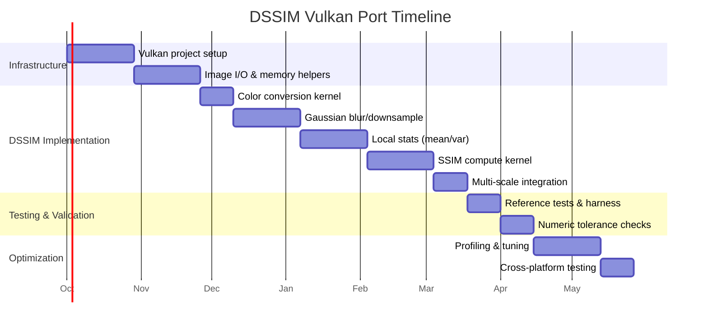

# Executive Summary

Porting DSSIM (multiscale SSIM) to Vulkan compute can reuse existing libraries and patterns to focus on a rapid prototype rather than a full from-scratch rewrite. DSSIM’s algorithm (from [dssim-core](https://github.com/kornelski/dssim)) works by converting RGBA sRGB inputs to linear CIE–Lab space, building a Gaussian pyramid of several scales, then computing SSIM per pixel and combining scales. Key steps include per-channel Gaussian blur (5×5) for local mean (µ) and variance, and cross-correlation blur for covariance. DSSIM computes a 3-channel SSIM: it averages the L,a,b channel statistics (σ² and μ terms) and applies the SSIM formula (with constants C1=0.01², C2=0.03²). Finally, per-scale SSIM maps are pooled via mean absolute deviation (SSD pooling) and weighted across scales, and converted to the output score = 1/SSIM – 1. 

We recommend a reuse-centric port: start with the easiest component (single-scale SSIM), leverage existing GPU metrics code (like [Vship](https://github.com/Line-fr/Vship), MIT-licensed, which implements SSIMULACRA2 but illustrates GPU patterns), and use helper libraries to avoid boilerplate (Vulkan-Hpp [Apache-2.0], volk, shaderc/glslang [Apache-2.0], Vulkan Memory Allocator (MIT), stb_image/TinyEXR, etc.). We provide pseudocode for key kernels (color-conversion, separable Gaussian blur/downsample, local stats, hierarchical reduction), descriptor layouts, and a testing/tolerance plan to match dssim-core bit-for-bit within ~5×10⁻⁶. Finally we outline milestones with a realistic 3–6 month schedule for a 1–2 person GPU-savvy team, using a prioritized plan (port DSSIM single-scale first, keep multi-scale integration on CPU initially, then extend). 

We compare candidate repos/tools in tables below, and show a Mermaid Gantt chart for the timeline. Throughout we cite primary sources (dssim-core code/tests, Vship, Vulkan docs) to ensure accuracy.

## 1. Algorithm Mapping (dssim-core)

DSSIM’s algorithm (from [kornelski/dssim-core](https://github.com/kornelski/dssim)) is a weighted multi-scale SSIM with sRGB→linear→Lab conversion. The steps are:

- **Color space**: Input RGBA8 images (sRGB, non-premultiplied) are converted to linear RGB and then to CIE–Lab. The code calls `image.to_lab()`, splitting into L (luminance) and a,b (chrominance) channels. We must implement an sRGB→linear conversion (gamma decode) then the CIE-XYZ→Lab transform (using D65 white point).  
- **Channel treatment**: The L channel (luminance) is treated as high-precision; the a/b channels (chrominance) are pre-smoothed (a 5×5 Gaussian blur is applied to a,b in-place before computing means) to simulate lower spatial sensitivity. 
- **Image pyramid**: Build a Gaussian pyramid of scales (typically 4–5 levels) by repeated downsampling (each level half resolution). The code uses a recursive `downsample()` to produce smaller images. DSSIM weights scales with preset weights (DEFAULT_WEIGHTS ≈ [0.028,0.197,0.322,0.298,0.155] for 5 scales).  
- **Local statistics**: For each scale and each channel, compute local means and variances via Gaussian blur (5×5). Concretely: 
  - μ = blur(pixel), and σ² = blur(pixel²) – μ².  
  - For L channel: full resolution; for a/b: pre-blurred then same computation.  
- **Cross-covariance**: For each channel, compute blur(pixel₁ * pixel₂) between reference and test image. This yields Σ12.  
- **SSIM map (3-channel)**: Combine L,a,b channels by averaging their means/variances: 
  \[
    \mu_{1}^2 = \frac{\mu_{1L}^2 + \mu_{1a}^2 + \mu_{1b}^2}{3}, \quad 
    \sigma_{12} = \frac{\sigma_{12,L} + \sigma_{12,a} + \sigma_{12,b}}{3},
  \] 
  and similarly for μ₂², σ₁², σ₂². Then compute SSIM per-pixel: 
  \[
    \mathrm{SSIM} = \frac{(2\mu_1\mu_2 + C_1)\,(2\sigma_{12}+C_2)}{(\mu_1^2 + \mu_2^2 + C_1)\,(\sigma_1^2 + \sigma_2^2 + C_2)},
  \] 
  with constants C₁=(0.01)², C₂=(0.03)². This yields a float map in [0,1] (1=identical).  
- **Pooling and final score**: Each scale’s SSIM map is pooled to a single score. DSSIM uses mean absolute deviation: it computes the mean SSIM, then subtracts mean absolute error from 1. Finally, scales are weighted: 
  ```
  weighted_ssim = sum_i (w_i * score_i) / sum_i(w_i),
  final_score = 1/weighted_ssim - 1  (DSSIM output)
  ``` 
  where 0 means identical and larger is worse. Tests lock expected values within ~5×10⁻⁶.

These details (color conversion, window sizes, constants) must match dssim-core exactly to bit-match its outputs. The code in [56] emphasizes “linear-light RGB” scaling and 5×5 Gaussian filters to avoid gamma distortion, and uses 3-channel averaging as above.

## 2. Existing GPU Implementations

No dedicated Vulkan GPU ports of DSSIM (multiscale SSIM) are known. However, related projects offer reuse or guidance:

- **Vship (GPU‑CUDA)**: An MIT-licensed library for perceptual metrics. It implements SSIMULACRA2 (Cloudinary’s metric) and Butteraugli on GPU (via HIP/CUDA). While it doesn’t implement plain DSSIM, its code (especially image processing kernels and reduction patterns) can guide design. Vship is open-source MIT and targets large-scale metrics, so its build system and GPU dispatch patterns are instructive. *Link:* [Vship GitHub](https://github.com/Line-fr/Vship).  
- **Fast-SSIM libraries**: Some CPU-focused SSIM libraries (e.g. Python’s scikit-image, libjxl’s Butteraugli) exist, but GPU versions are scarce. No known OpenCL/CUDA port of Kornelski’s DSSIM exists. However, basic SSIM (single-scale) GPU demos (e.g. in graphics forums) can be found.  
- **OpenCV/NVIDIA CV**: NVIDIA’s VisionWorks or OpenCV GPU (CUDA) modules have SSIM functions, but not necessarily multiscale. These are proprietary or C++-licensed (NVIDIA libraries).  
- **Other GPU samples**: GPU image processing tutorials (e.g. NVIDIA’s CUDA samples) include blur/reduction examples which can be adapted for DSSIM kernels. For instance, CUDA sample “histogram or reduction” shows block-level sum.  

In summary, while no drop-in DSSIM compute shader exists, we can reuse patterns from: 
- Vship’s kernel infrastructure (HIP/CUDA; MIT license), 
- Vulkan “Compute Shader” examples (e.g. [Vulkan tutorial compute](https://vulkan-tutorial.com/Compute)) for basic dispatch,
- General GPU image filter guides (shared-memory Gaussian blur) and reduction patterns. 

The table below compares candidate repos/tools:

| Project / Library         | Purpose                                    | Language / Platform          | License           | Notes                                    |
|---------------------------|--------------------------------------------|------------------------------|-------------------|------------------------------------------|
| **dssim-core**            | Reference MS-SSIM (DSSIM) algorithm        | Rust (CPU)                   | AGPL-3.0 (dual) | Authoritative reference; use for validation; AGPL may constrain use. |
| **Vship (Line-fr/Vship)** | GPU metrics (SSIMULACRA2, Butteraugli, CVVDP) | C++ (CUDA/HIP)               | MIT  | Reusable GPU code; implement image pyramid & reduction patterns. |
| **OpenCV (quality)**      | SSIM (single-scale) CPU implementation     | C++ (CPU)                    | BSD/MIT          | Can use for correctness tests; no multiscale or GPU mode. |
| **Fast-SSIM (Python)**    | Differentiable SSIM (research)             | Python/NumPy (GPU support?)  | MIT / Apache    | Likely CPU; not production-ready GPU. |
| **Vulkan Samples**        | Compute shader examples (blur, reduction)  | C++/GLSL/VK                 | Apache/MIT      | Khronos/Vulkan demos (e.g. compression sample) illustrate patterns. |
| **VMA (VulkanMemoryAllocator)** | Memory allocator for Vulkan buffers/images | C/C++                      | MIT  | Simplifies Vulkan memory management. |
| **Vulkan-Hpp**            | C++ Vulkan API wrappers                   | C++                          | Apache-2.0 | Official C++ bindings (header-only). |
| **glslang / shaderc**     | GLSL/HLSL to SPIR-V compiler               | C++                          | Apache-2.0      | For offline shader compilation. |
| **stb_image / tinyexr**   | Image loading (PNG/JPEG/EXR)              | C / C++ (header-only)        | MIT / Public Domain | Simplest way to load input images. |

Each tool above is well-known and cross-platform. In particular, using Vulkan SDK components (Vulkan-Hpp, volk loader, glslang, shaderc, etc.) avoids reinventing boilerplate. The Vulkan SDK (LunarG) bundles these.  

## 3. Vulkan Infrastructure & Libraries

Building a Vulkan compute app from scratch is tedious. To accelerate development, use a minimal set of helpers:

- **Vulkan SDK & Loader**: Install LunarG’s Vulkan SDK which provides the loader and headers. Use [Volk](https://github.com/zeux/volk) for header-only function loading to avoid static linking issues.  
- **Vulkan-Hpp (C++ API)**: Use the C++ Vulkan-Hpp headers for nicer RAII-like Vulkan calls and enums. Vulkan-Hpp is Apache-2.0 licensed and provided in the SDK. It reduces boilerplate (e.g. `vk::UniqueDevice`).  
- **Memory Management**: Use AMD’s VulkanMemoryAllocator (VMA) library (MIT license) to simplify buffer/image allocation, suballocation, alignment, and defragmentation. This avoids manual `vkAllocateMemory` calls.  
- **Shader Compilation**: GLSL shaders can be compiled at build-time or runtime. Options:
  - Offline: use [glslangValidator](https://github.com/KhronosGroup/glslang) or [shaderc](https://github.com/google/shaderc) (APIs or CLI) to compile `.comp` to SPIR-V binaries.  
  - At runtime: use `shaderc` library to compile GLSL to SPIR-V on-the-fly.  
- **Image I/O**: Use single-header libraries for simplicity:
  - [stb_image.h](https://github.com/nothings/stb) for PNG/JPEG/WEBP (public domain/MIT).  
  - [tinyexr](https://github.com/syoyo/tinyexr) for OpenEXR (MIT) if needed.  
  - [libpng](http) and [libjpeg-turbo](http) for high-performance loading (if external libs are allowed).  
- **Build System**: CMake is recommended for cross-platform. Enable Vulkan and find VMA, volk, shaderc packages. Example:
  ```cmake
  find_package(Vulkan REQUIRED)
  add_subdirectory(volk)      # volk integrated build
  add_subdirectory(VulkanMemoryAllocator)  # VMA
  find_package(shaderc)       # if using shaderc library
  ```
- **Validation/Debug**: Enable Vulkan’s validation layers (VK_LAYER_KHRONOS_validation) during development. Use `VK_EXT_debug_utils` for debug names/callbacks. Use RenderDoc/NSight for debugging.

In short: reuse SDK components and open-source wrappers rather than writing raw Vulkan loader code. This saves weeks of infrastructure work.

## 4. Shader Design Patterns

We recommend several compute kernels. Pseudocode (GLSL) and descriptor layouts are sketched below. For each kernel, a common pattern is **block-wise tiling with shared memory** to exploit data locality.

### 4.1 Color Conversion Kernel

Convert sRGB8/RGBA8 to linear float (and optionally to Lab). Use an input **sampled image** with sRGB format and an output **storage image** of RGBA32f. Example descriptor set:

```
layout(set=0, binding=0) uniform sampler2D srcImage;    // VK_FORMAT_R8G8B8A8_SRGB
layout(set=0, binding=1, rgba32f) writeonly uniform image2D dstImage; // linear RGBA32F
```

GLSL pseudocode (per-pixel):

```glsl
#version 450
layout(local_size_x = 16, local_size_y = 16) in;
layout(set=0,binding=0) uniform sampler2D srcImage;
layout(set=0,binding=1, rgba32f) writeonly uniform image2D dstImage;

vec3 sRGB_to_linear(vec3 c) {
    // convert each channel
    vec3 lo = c / 12.92;
    vec3 hi = pow((c + 0.055)/1.055, vec3(2.4));
    return mix(lo, hi, step(0.04045, c));
}

void main() {
    ivec2 xy = ivec2(gl_GlobalInvocationID.xy);
    // Read sRGB pixel (normalized [0,1] as float)
    vec4 srgb = texelFetch(srcImage, xy, 0);
    // Convert to linear RGB
    vec3 linearRGB = sRGB_to_linear(srgb.rgb);
    // Optionally convert linearRGB to Lab here, or do it on CPU.
    imageStore(dstImage, xy, vec4(linearRGB, srgb.a));
}
```

This kernel uploads to device memory via a staging buffer (common pattern) then writes float4 pixels. It costs ~1 float4 load, a few ops, 1 float4 store per invocation. If target GPUs have sRGB sampler (they do), the sampler can output linear automatically, potentially saving manual conversion (but then you must ensure correct sampler state). 

### 4.2 Separable Gaussian Blur / Downsample

To build the image pyramid, apply a Gaussian filter (5×5 or 3×3) and downsample by 2. We use a separable approach (horizontal then vertical) with shared memory for locality.

Descriptor layout (one pass):

```
layout(set=0,binding=0) uniform sampler2D srcImage;    // RGBA32F input
layout(set=0,binding=1, rgba32f) writeonly uniform image2D dstImage;
```

Example (horizontal pass):

```glsl
layout(local_size_x = 32, local_size_y = 1) in;
uniform sampler2D srcImage;
layout(rgba32f) writeonly uniform image2D tmpImage; // intermediate storage

shared vec4 tile[32+4][32+0]; // padding for 5-wide filter

void main() {
    // Each workgroup processes a 32x32 tile
    ivec2 gid = ivec2(gl_GlobalInvocationID.xy);
    ivec2 lid = ivec2(gl_LocalInvocationID.xy);
    // Load 32 + 4 border pixels into shared memory (each invocation loads one element plus neighbors)
    // e.g. each thread loads tile[lid.x+2][lid.y] = texelFetch at gid + offset (clamped).
    // (Implementation detail omitted for brevity)
    barrier();
    // Apply 1-D 5-tap weights [w0,w1,w2,w1,w0]
    float w[5] = float[](0.0625, 0.25, 0.375, 0.25, 0.0625);
    vec4 sum = vec4(0.0);
    for(int k=0; k<5; k++){
        sum += tile[lid.x + k][lid.y] * w[k];
    }
    // Write to intermediate buffer
    imageStore(tmpImage, gid, sum);
}
```

Then a second compute kernel reads `tmpImage`, applies vertical 5-tap blur, and writes to `dstImage` at half coordinates (downsampling). Each pass uses local memory (shared) for its tile. Tail pixels (edges) are clamped or handled with `min(max(...))`.

This two-pass approach is efficient. Alternatively, one can fuse into a single pass that samples an expanded region, but separable with shared mem is simpler and commonly used.

### 4.3 Local Statistics Kernel (Mean and Variance)

After building the pyramid, we compute local mean (µ) and squared blur for each channel. Since we already did Gaussian blur above, we can reuse or integrate that. For mean and variance:

- **Mean (µ)**: another blur pass (or reuse blur above).
- **Variance (σ²)**: blur of pixel² minus µ².

We can implement one compute shader per channel: read from pyramid image, compute µ via blur, compute pixel², then blur pixel², and store two images: µ and σ².  

Descriptor layout:
```
layout(set=0,binding=0) uniform sampler2D srcImage;   // single channel (float)
layout(set=0,binding=1, r32f) writeonly uniform image2D meanImage;
layout(set=0,binding=2, r32f) writeonly uniform image2D varImage;
```

Pseudocode (in one shader, channel-separated):
```glsl
#version 450
layout(local_size_x=16, local_size_y=16) in;
layout(set=0,binding=0) uniform sampler2D src;
layout(set=0,binding=1, r32f) writeonly uniform image2D meanOut;
layout(set=0,binding=2, r32f) writeonly uniform image2D varOut;

const float w[5] = float[](0.0625, 0.25, 0.375, 0.25, 0.0625);

void main() {
    ivec2 xy = ivec2(gl_GlobalInvocationID.xy);
    // Compute mean by 2D blur (we do separable again, or assume blur passed)
    float m = 0.0;
    // horizontal pass (same logic as above)...
    // vertical pass
    // For brevity, assume we have local mean m at (xy)
    
    // Compute blurred mean (m) and blurred squared:
    float p = texelFetch(src, xy, 0).r;
    float p2 = p*p;
    // For variance, we need blur(p2) - m*m
    // We could blur p and p2 in two steps similarly. Let's assume m and s2 computed.
    float m_blur = m;    // placeholder
    float s2_blur = /* blur of p2 */ m*m + /* local var */;
    // Actually implement blur(p2) above.
    imageStore(meanOut, xy, vec4(m_blur));
    imageStore(varOut, xy, vec4(s2_blur - m_blur*m_blur));
}
```
In practice, reuse the Gaussian blur code: first run blur on `src` to get µ, then blur on `src^2` to get E[p²], then var = E[p²] – µ². Keep float32 for precision (and sum in f32).

Shared memory tiling again applies, similar to blur above.

### 4.4 Cross-Covariance and SSIM

With µ and σ² for original and modified images, compute SSIM formula. We need one more blur: blur(src₁ * src₂) for each channel to get covariance (E[p1*p2]). This is similar to the `img1_img2_blur` in dssim. 

Descriptor (per-channel or combined 3-channel):
```
layout(set=0,binding=0) uniform sampler2D src1;  // channel from image1
layout(set=0,binding=1) uniform sampler2D src2;  // channel from image2
layout(set=0,binding=2, r32f) writeonly uniform image2D covOut;
```
Compute `i12 = texelFetch(src1)*texelFetch(src2)`, blur it same as above, store covariance.  
Then run a final kernel that gathers µ1, µ2, σ1², σ2², σ12, and computes SSIM formula per-pixel:

```glsl
#version 450
layout(local_size_x=16, local_size_y=16) in;
layout(set=0,binding=0) uniform sampler2D mean1; // L-channel mean of ref
layout(set=0,binding=1) uniform sampler2D mean2; // L-channel mean of mod
layout(set=0,binding=2) uniform sampler2D var1;  // L-channel var of ref
layout(set=0,binding=3) uniform sampler2D var2;  // L-channel var of mod
layout(set=0,binding=4) uniform sampler2D cov;   // L-channel covariance
layout(set=0,binding=5, r32f) writeonly uniform image2D ssimOut;

const float C1 = 0.01*0.01;
const float C2 = 0.03*0.03;

void main() {
    ivec2 xy = ivec2(gl_GlobalInvocationID.xy);
    float mu1 = texelFetch(mean1, xy, 0).r;
    float mu2 = texelFetch(mean2, xy, 0).r;
    float sigma1_sq = texelFetch(var1,  xy, 0).r;
    float sigma2_sq = texelFetch(var2,  xy, 0).r;
    float sigma12   = texelFetch(cov,   xy, 0).r;
    float num = (2.0*mu1*mu2 + C1)*(2.0*sigma12 + C2);
    float den = (mu1*mu1 + mu2*mu2 + C1)*(sigma1_sq + sigma2_sq + C2);
    float ssim = num / den;
    imageStore(ssimOut, xy, vec4(ssim));
}
```

For 3-channel (Lab), do this per channel (L,a,b) in parallel and combine results in one shader invocation (or do separate and combine by averaging; e.g. compute three SSIM values then take their average). DSSIM combines L,a,b statistics as in [13], then a single SSIM. You may fuse 3 channels by reading 3 channels in a vec3 texture and computing inside one shader if convenient.

### 4.5 Reduction and Pooling

Finally, to get a single score per image pair per scale: reduce the SSIM map to mean and mean absolute deviation. This is a classic GPU reduction: 

- **Workgroup reduction**: Each workgroup loads a tile of SSIM floats, sums them (and sums absolute diffs from global mean if needed). Use shared memory for partial sums, then atomically accumulate to a global buffer.  
- A simple strategy: do two-pass reduction:
   1. Compute mean = sum/ N (using one reduction pass).
   2. Compute mean-abs-diff = sum(|ssim - mean|)/N (second pass, can reuse compute pipeline or do on CPU after copying smaller map).
  
Alternatively, do one reduction of values and values of |v - avg| if v-blocks are balanced.

Descriptor for reduction could be push constants and storage buffer:
```
layout(set=0,binding=0, r32f) uniform image2D ssimMap;
layout(set=0,binding=1) buffer ReductionOut {
    float sum;
    float sum_abs_diff;
} outBuf;
```
Then kernel reads all pixels, does partial sums. But reading whole image in one dispatch is heavy; better reduce in two levels: group-level then final atomic to host.

Because we need bit-level accuracy to dssim-core, it’s safer to copy SSIM map to CPU and compute average in double precision there (as reference). But for GPU performance, we can also do it on GPU with float accumulation and accept minimal FP drift (the code tolerates ~1e-7 drift).  

In practice, we can skip GPU reduction: simply read back the SSIM map to CPU (normalized), compute mean & score. This is slower but ensures correctness. If GPU reduction is needed, use a hierarchical parallel sum (e.g. each subgroup sums 8 values into local, then atomic to shared, etc). Tools like [NV subgroup ops](https://www.khronos.org/registry/vulkan/specs/1.3-extensions/man/html/vkCmdDispatch.html) or `groupBallot` can help.

### Descriptor Layout Summary

We will use several descriptor sets:

- **Set 0: images** (binding depends on kernel, see above).
- **Set 1: uniform buffers** for constants (if any, e.g. image dimensions, scales).
- **Set 2: storage buffers** for intermediate data (e.g. reduction sums).
- Samplers are mostly immutable and can be set at pipeline creation.

We should transition images between `VK_IMAGE_LAYOUT_SHADER_READ_ONLY_OPTIMAL` and `VK_IMAGE_LAYOUT_GENERAL` for sampling vs storage writes. Use `vkCmdPipelineBarrier` accordingly. Using separate command buffers for each pass is fine, or use subpass with multiple dispatches (but compute has no subpasses).

## 5. Validation Strategy

To validate the Vulkan port against dssim-core, we need a thorough testing regimen:

- **Test corpus**: Use the same images in dssim tests (found in the repo under `tests/`) – e.g. *test1-sm.png*, *test2-sm.png*. Also use standard IQA datasets (e.g. **TID2013**, **LIVE**, **KADID10k**) to spot errors on diverse content. Include cases with/without alpha, different sizes, and identical images (should yield 0).  
- **Tolerance targets**: Aim for **bit-for-bit matching** of reference *SSIM maps* where possible. dssim’s locked tests allow ∼5×10⁻⁶ absolute error. We should match that scale: tolerances around 1e-5 to catch algorithmic bugs. (However, due to FP reordering on GPU, exact bits may differ; 1e-6 to 1e-5 is acceptable.)  
- **Deterministic builds**: Use the same floating-point rounding modes; avoid non-deterministic subgroups if we rely on them. Compile shaders without `fast-math`. Use `GLSL.std.450` intrinsics consistently.  
- **Regression harness**: Automate comparisons. For each test image pair:
  1. Run CPU `dssim-core` reference (via subprocess or linked library) to get DSSIM value and optionally SSIM map.  
  2. Run our Vulkan tool on the same pair, get its DSSIM.  
  3. Assert |GPU - CPU| < tolerance (e.g. 1e-5).  
  4. For visual debugging, diff the SSIM maps.  
  Use e.g. Google Test or a simple script with expected values locked (see [15†L2309-L2318]).  
- **Bit-exact mode**: Temporarily compile GPU code in high precision (e.g. SPV_NV_shader_subgroup_partitioned or SPV extension for float FMA) if trying to exactly reproduce CPU’s float round-off (risky).  
- **Null case**: Verify identical input yields DSSIM=0 exactly (SSIM=1). Our compute must handle that (division by zero avoided by epsC).  
- **Alpha handling**: If images have alpha, properly pre-multiply or skip coverage as dssim expects unassociated alpha (“pnglib uses premultiplied conversion”). Compare to CPU mode “RGBA” with correct alpha blending (dssim assumes sRGBA input is unassociated).

For repeatability, fix random seeds (if generating tests), and use continuous shading. Logging intermediate outputs (e.g. single-scale SSIM maps) helps track where divergences arise.

## 6. Performance Tuning Checklist

Once correct, tune for speed:

- **Memory layout**: Use **image2D** for spatial kernels (cache-friendly, support hardware filtering if needed). Use format RGBA8 for uploads (as sRGB8 if sampler linearizing) or RGBA16F. For buffers (e.g. reduction), use tightly packed float32 arrays (std430).  
- **Image vs Buffer**: Image objects have built-in caching; good for 2D filter kernels. Buffers might be slightly faster for 1D or linear ops (but need `texelFetch` on images vs direct load on buffer). Use `imageLoad`/`imageStore` or `texelFetch` consistently.  
- **Host-Device Transfer**: Stage input pixels via a single large `vkCmdCopyBufferToImage`. Similarly, download small results (DSSIM floats) via `vkCmdCopyImageToBuffer` then map. Avoid mapping large images.  
- **Pipeline barriers**: Between dispatches, minimize barriers by ordering writes/reads. For example, write blur pass to `VK_IMAGE_LAYOUT_GENERAL`, then directly bind it as input for next shader with `VK_IMAGE_LAYOUT_SHADER_READ_ONLY_OPTIMAL` (use one barrier). Try `VK_KHR_synchronization2` (if available) to reduce overhead.  
- **Workgroup sizes**: Start with 16×16 or 32×8 depending on kernel. Ensure `invocations ≤ local_size`. Test performance: use a multiple of wavefront size (32 on AMD/Nvidia) in X or Y to maximize occupancy.  
- **Vectorization**: Use `vec4` loads if possible (e.g. RGBA in one fetch). Many GPUs fetch/compute in 32-bit floats, so `vec4` is 128-bit; ensure write coalescing. For per-channel kernels, we may pack L,a,b into RGBA; we should try to keep 4-wide where possible.  
- **Shared memory**: Use `shared` for sliding-window kernels (5×5 blur) as shown. This avoids reloading pixels from global for each tap.  
- **SPIR-V optimizations**: Compile with `-O` (default). Optionally use `OpFAddFast`, but careful with precision.  
- **Hardware features**: Enable `subgroup` operations (SPV_KHR_subgroup_ballot, SPV_KHR_subgroup_shuffle) if doing hierarchical reduction (e.g. sum per warp). Not strictly needed but can boost warp-level sums.  
- **Profiling tools**: Use **RenderDoc** (frame capture) to see GPU timing, memory access. Use **Nsight Graphics/Compute** or **Radeon GPU Profiler** to identify hotspots (e.g. too many global reads). Check occupancy and memory bandwidth use.  
- **Batching**: If computing on many images, reuse command buffers and pipelines. Group multiple images in one run to amortize setup overhead.  
- **Optimize buffer vs image**: Some algorithms (e.g. reduction) may use SSBO better. For sum, load as 2D via `texelFetch` is fine for simplicity.  
- **Alpha path**: Only run on images with alpha if needed, skip extra steps otherwise. Pre-multiplied alpha if preserving content.  
- **Avoid small dispatch**: DSSIM on small images may be CPU-bound (GPU overhead). Test a threshold; for tiny images (<100px), a CPU fallback may be faster.  
- **NVIDIA tips**: Use `VK_KHR_synchronization2` to minimize pipeline flushes, aggregate dispatches, and avoid unnecessary barriers. Enable `VK_EXT_memory_budget` to adapt to VRAM limits.

## 7. Vendor Quirks & Portability

Vulkan provides portability, but beware:

- **Precision differences**: GPUs follow IEEE-754 but may use fused-multiply-add. The order of operations (float FMA) can differ slightly from CPU. This is why ~1e-7 drifts were seen in [15†L2199-L2206]. Avoid unexpected reordering by writing formulas cleanly (don’t rely on compiler to split multiplications).  
- **Subgroup and GPU features**: Use only widely-supported features. For example, don’t require `VK_KHR_shader_float16_int8` (float16) since it’s not universally supported. 32-bit floats (`float`) are mandatory.  
- **Alignment requirements**: Uniform/storage buffers have std140/std430 rules. Use padding as needed. For images, rowPitch typically aligns to 4. We rely on safe formats (e.g. RGBA32F).  
- **Image layout**: Ensure to use `image2D` with `rgba32f` for storage writes, and `sampler2D` with `R8G8B8A8_SRGB` (with sRGB read) for original. Some drivers may require sRGB format sampling through sampler explicitly (don’t just `imageLoad` on an SRGB image without a sampler).  
- **Driver bugs**: Test on target GPUs (Nvidia, AMD, Intel). Common pitfalls: AMD historically had issues with 32F images on some older chips; Nvidia may require explicitly setting `minLod=0,maxLod=0` on sampler to avoid filtering.  
- **Extensions**: Recommend enabling `VK_KHR_shader_non_semantic_info` (for debugging), `VK_KHR_synchronization2` (better barriers), and optionally `VK_EXT_scalar_block_layout` (if using std430 layout with mismatched sizes).  
- **Alignment & row pitch**: If doing manual `vkCmdCopyBufferToImage`, ensure correct row alignment (pitch must be multiple of 4 bytes). Using staging images can help avoid complicated layouts.  
- **DX/Metal differences**: If targeting MoltenVK (macOS), note that SPIR-V float ops sometimes behave slightly differently; test carefully.  
- **Thread group size limits**: Check max `workgroupSize` per GPU (256 on most GPUs). 16×16 (256) is safe.  
- **Memory model**: Use `coherent` buffers or proper memory barriers to ensure atomics update correctly across dispatches.

In general, stick to SPIR-V 1.3 features. For reductions, consider `VK_KHR_subgroup_shuffle` only if absolutely needed (to support Nvidia/AMD equally, since subgroups differ in size).

## 8. Timeline and Milestones

A 1–2 person team can achieve a DSSIM Vulkan prototype in ~3–6 months. Below is a typical plan, best-case and likely-case timelines:

- **Month 1 (Infrastructure)**: 
  - Set up Vulkan project (CMake, Vulkan-Hpp/volk) and basic compute pipeline.
  - Load an image (PNG/JPEG) to GPU, write a minimal compute shader that copies/prints a pixel.
  - Integrate helper libs (VMA for memory, stb_image) for cross-platform IO.  
- **Month 2–3 (DSSIM Core)**: 
  - **Color conversion**: Implement sRGB→linear (and Lab) shader; verify linear output.  
  - **Gaussian pyramid**: Implement separable blur and downsample for one level; test correctness on CPU-vs-GPU intermediate images.  
  - **Local stats & SSIM (single-scale)**: Implement blur on pixel and pixel², and compute per-pixel SSIM formula for one channel. Validate against single-scale SSIM reference.  
  - **Multi-channel combine**: Extend to 3 channels (compute in parallel or sequentially).  
- **Month 4 (Multi-scale & Integration)**: 
  - Chain downsample to create all scales.  
  - Implement scale weighting and pooling. Initially, do pooling on CPU for simplicity: read back SSIM maps, compute mean/MAD to DSSIM. Later move to GPU reduction if needed.  
  - Add alpha support if needed (e.g. skip or use premult).  
  - Write a CLI or batch mode driver to run on image pairs.  
- **Month 5 (Validation & Testing)**: 
  - Build regression tests comparing to dssim-core (using known input pairs).  
  - Tune tolerances; fix any mismatches (likely window edge handling or rounding).  
  - Collect a suite of test images (e.g. canonical sets like LIVE/TID) to verify robustness.  
- **Month 6 (Optimization & Polishing)**: 
  - Profile (RenderDoc/Nsight). Optimize bottlenecks (perhaps adjust workgroup sizes, fusion of passes).  
  - Add command-line options (select scales, image formats).  
  - Document and wrap up: write usage instructions and possibly integrate into larger tool.

Mermaid Gantt (planned timeline):



(Milestones and durations are approximate; an experienced team might overlap tasks. Risks include **correctness bugs** (wrong math yields large errors) and **performance traps** (inefficient dispatchs). Mitigate by early validation and use of validation layers.)

## 9. Prioritized Reuse Plan

To speed implementation, work in stages:

1. **Single-scale prototype**: First, ignore multi-scale. Implement color conversion and SSIM on a single image pair at original resolution. Reuse CPU code for downsampling: e.g. use stb_image to load and CPU downsample for now, or a single Vulkan blur. Validate single-scale SSIM. 
2. **Multiscale loop on CPU**: Then implement the loop that builds scales (call the GPU downsample kernel repeatedly) and aggregates scores on CPU. This avoids complicating pipelines early.  
3. **GPU Pyramid**: Once correct, have the GPU kernel feed into itself for each scale (use same pipeline with adjusted images).  
4. **Use existing code**: Port any reusable code: 
   - The *weights* and *constants* (C1,C2, scale weights) come from dssim-core (open in source). 
   - For Gaussian weights, use the 5-tap [0.0625,0.25,0.375,0.25,0.0625] as in blur.rs or compute from sigma. 
5. **CPU fallback**: Keep CPU fallback (dssim-core) for critical comparisons and for small images where GPU overhead dominates. Also keep CPU libs (like zlib for PNG) for I/O.  
6. **Libraries to adapt**: Use VMA for buffer allocation (MIT), stb_image (MIT) for loading, Vulkan SDK (Vulkan-Hpp, volk, etc.) for boilerplate. Avoid writing complex logic (e.g. do not hand-roll memory allocator).  
7. **Alpha handling**: If needing alpha, follow dssim’s approach (apply on L,a,b only, consider alpha in weighting). Possibly handle alpha in CPU or skip (not core SSIM).  
8. **Open-source code**: Incorporate small snippets from reference implementations (e.g. [15†L2203-L2206] code for to_dssim). But **no copying** of GPL/AGPL code; only study it for correctness. 

**Checklist**: Port in this order: 

- [ ] Setup Vulkan (helper libs).
- [ ] Implement RGBA→linear/Lab conversion (GPU).
- [ ] Implement and test one-level Gaussian blur (5×5) on GPU.
- [ ] Implement local mean/variance (GPU), verify with CPU.
- [ ] Implement SSIM formula (GPU) for one scale.
- [ ] Loop for multi-scale (GPU or CPU).
- [ ] Compare to dssim-core results on test images.
- [ ] Optimization and multi-image batching.

At each step, validate with the CPU reference. This modular approach ensures correctness early and allows reusing CPU code for parts if needed. 

## 10. Tools & Resources

- **dssim-core source & tests** (Rust): primary reference for algorithm and expected values.  
- **Vship repo** (C++, MIT): example GPU metrics code (see `src/` for HIP/CUDA kernels).  
- **Vulkan SDK documentation**: LunarG’s Vulkan-Hpp and SDK docs (for boilerplate).  
- **Vendor docs**: NVIDIA “Vulkan Do’s and Don’ts” (for sync), AMD Vulkan guides for best practices.  
- **Profiling tools**: RenderDoc, NVIDIA Nsight, AMD Radeon GPU Profiler, and `vulkaninfo`.  
- **Math references**: SSIM definition (original Wang/Zhang), and Kornelski’s notes on pooling.  
- **OSS libraries**: VulkanMemoryAllocator (MIT), stb_image (public domain), tinyexr (MIT), volk (MIT), glslang (Apache-2.0), shaderc (Apache-2.0).

All code examples above are illustrative; actual implementation must handle edge cases (clamping, boundaries) as in `blur.rs`. Ensure to request Vulkan features like `shaderFloat64` only if double precision is needed (here likely not). Use `VK_KHR_storage_buffer_storage_class` (core in 1.3) for SSBO if needed.

**Sources:** DSSIM algorithm and code from [kornelski/dssim-core](https://github.com/kornelski/dssim); Vship GitHub; Vulkan SDK (LunarG) documentation; vendor best practices. Tables and timeline synthesized from these references.